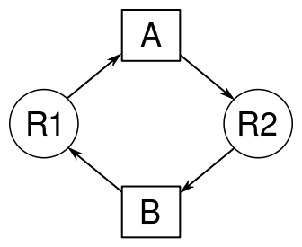

DEADLOCK (acontece tanto em sistemas operacionais quanto em banco de dados)

Deadlock (interbloqueio, blocagem, impasse), no contexto de sistemas operacionais (SO), refere-se a uma situação em que ocorre um impasse, e dois ou mais processos ficam impedidos de continuar suas execuções - ou seja, ficam bloqueados, esperando uns pelos outros.

Tanenbaum: 
 - Um conjunto de processos estará em situação de deadlock se todo processo pertencente ao conjunto estiver esperando por um evento que somente um outro processo desse mesmo conjunto poderá fazer acontecer.

Em muitos casos, um processo não necessita apenas de acesso exclusivo a somente um recurso, mas sim a vários. Por exemplo, dois processos querem gravar em CD um documento obtido pelo scanner. O processo A está usando o scanner, enquanto o processo B, que é programado diferentemente, está usando o gravador de CD. Então, o processo A pede para usar o gravador de CD, mas a solicitação é negada até que o processo B o libere. Porém, ao invés de liberar o gravador de CD, o processo B pede para usar o scanner. Nesse momento, ambos os processos ficam bloqueados e assim ficarão para sempre. Essa situação é denominada deadlock.

O deadlock pode ocorrer mesmo que haja somente um processo no SO, considerando que este processo utilize múltiplos threads e que tais threads requisitem os recursos alocados a outros threads no mesmo processo;

O deadlock independe da quantidade de recursos disponíveis no sistema;

Condições necessárias para a ocorrência de deadlock

As três primeiras caracterizam um modelo de sistema, e a última é o deadlock propriamente dito

- Condição de exclusão mútua. Em um determinado instante, cada recurso está em uma de duas situações: ou associado a um único processo ou disponível.
- Condição de posso e espera. Processos que, em um determinado instante, retêm recursos concedidos anteriormente podem requisitar novos recursos.
- Condição de não preempção. Recursos concedidos previamente a um processo não podem ser tomados a força desse processo, eles devem ser explicitamente liberados pelo processo que os retém.
- Condição de espera circular. Deve existir u encadeamento circular de dois ou mais processos; cada um deles encontra-se à espera de um recurso que está sendo usado pelo membro seguinte dessa cadeia.

Todas essas condições devem ocorrer simultaneamente para que ocorra um deadlock. Se uma dessas condições não ocorrer, não haverá deadlock.

Representação de deadlock em grafos

O processo é representado por um quadrado

Recurso por um círculo

Quando um processo solicita um recurso, uma seta é dirigida do quadrado ao círculo. Quando um recurso é alocado a um processo, uma seta é dirigida do círculo ao quadrado.

Na figura do exemplo, podem-se ver dois processos diferentes (A e B), cada um com um recurso diferente alocado (R1 e R2). Nesse exemplo clássico de deadlock, é facilmente visível a condição de espera circular em que os processos se encontram, onde cada um solicita o recurso que está alocado ao outro processo.

Métodos para tratar deadlocks

(continuar : https://pt.wikipedia.org/wiki/Deadlock)

FONTES: 
- https://pt.wikipedia.org/wiki/Deadlock
- https://www.devmedia.com.br/introducao-ao-deadlock/24794
